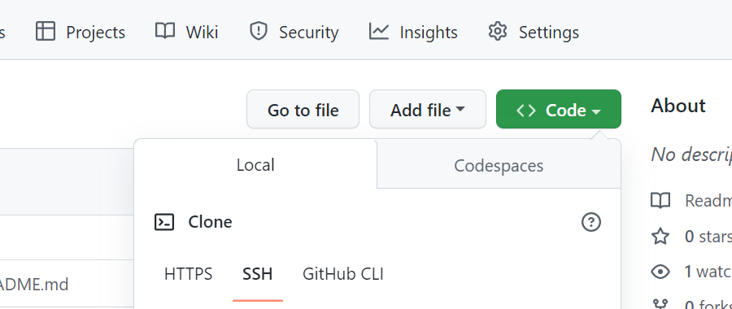
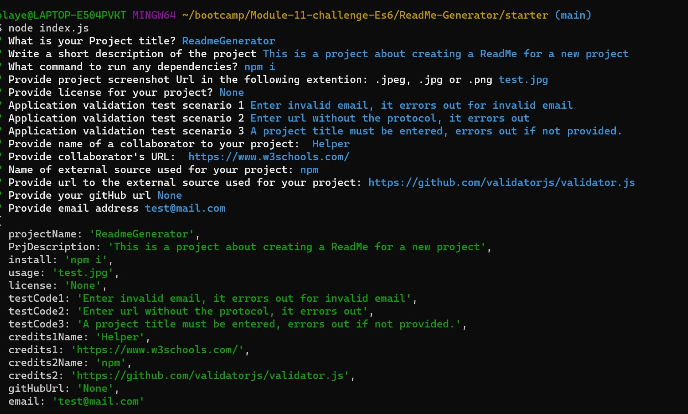
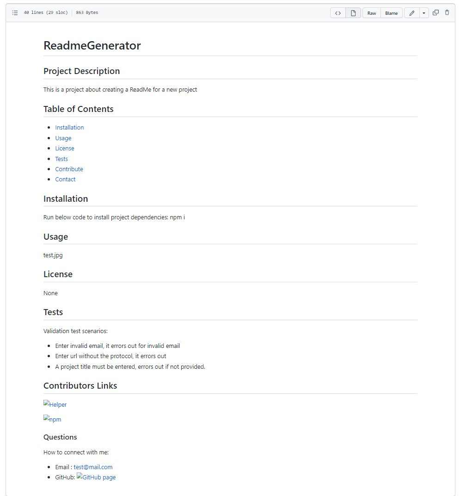

# ReadMe-Generator
## Project Description
This is a project about creating a ReadMe for a new project using Es6 using command-line application to accepts user input and then generate an md file based on the answers entered by the user.

Some of the input validations in place are:
- User *must* input a Project title.
- User *must* input a Project descriptions.
- User *must* input a valid email in the correct format (test@test.com).
- When prompt for web URLs, the input type must include the protocol value (*http* or *https*).

## Table of Contents

* [Installation](#Installation)
* [Usage](#Usage)
* [Demo](#Demo)
* [License](#License)
* [Tests](#Tests)
* [Packages](#Packages)
* [Contribute](#Contributors-Links)

## Installation
**How to run project on local machine**
* Install Visual Studio Code
* Download *node.js*
* Navigate to main page of the git Repository
* Click on the 'Code'
* Copy the SSH line to run on the Terminal or  the HTTPS link
* Clone the repository - 
*  Run below code to install project dependencies:
    *npm i*

## Usage
Answer the prompted questions to generated an md file sample below.

## Demo
**Demo Video QR link below**

**Demo Video link below**

## Tests
Validation test scenarios on user input:
* Enter invalid email format,  it errors out for invalid email 
* Enter url without the protocol, it output error message.
* A project title must be entered else, output error message. 
* A project description must be entered else, output error message. 

## Packages
*inquirer 6.3.1*
*validator 13.9.0*
*email-validator 2.0.4*

## Contributors Links

[W3schools](https://www.w3schools.com/js/default.asp)

[codingBootcamp](https://coding-boot-camp.github.io/full-stack/github/professional-readme-guide)

If you want to learn more about git clone. you can seek inspiration from the below:

[Github Docs](https://docs.github.com/en/repositories)